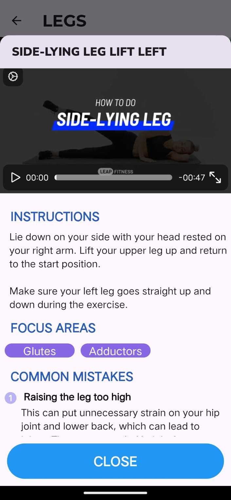
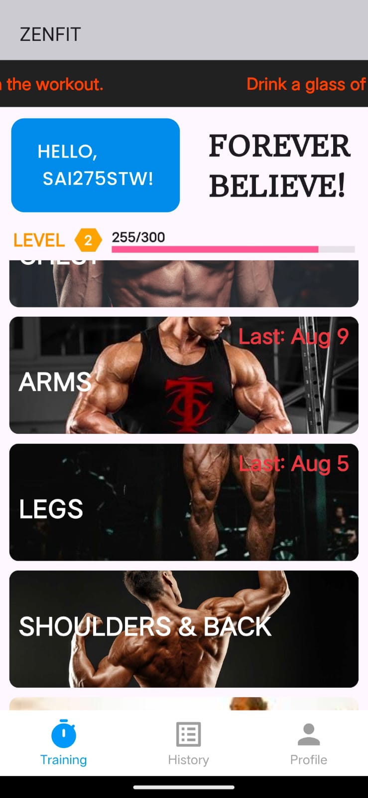
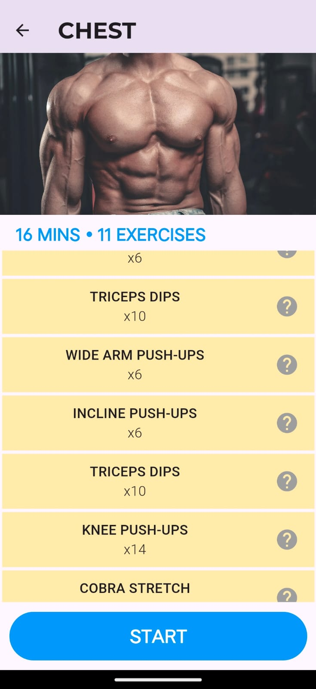

# Fitness

A Home Fitness App.

## Introduction

Users can log in or register for free.  
Once logged in, users can choose which workout they wish to do once logged in.  
"How to do" is available for all the workouts included in the app.  
During workouts, users can restart, pause, or skip the current exercise.  
If a user happens to quit the workout, feedback is taken to improve the workouts.  
A History screen is available to show past workouts, and the Profile screen allows users to manage weight, height, workout preferences, and other personal data.

Data storage and user authentication are implemented with Firebase.  
All dependencies/packages utilized are mentioned in 'pubspec.yaml'

## Running

To run this app:

1. Download all files and folders to a directory.
2. Connect to an Android emulator or a smartphone with USB debugging enabled.
3. In the terminal, run the command:

   ```bash
   flutter run

<div style="display: flex; justify-content: space-around; gap: 20px; padding: 10px;">
  
  
  
  
</div>

## Project Report

This project aims to facilitate working out at home or in the absence of gym facilities. Despite the growing awareness of the importance of physical health, many individuals struggle to maintain consistency due to a lack of motivation and guidance. This app addresses that issue by providing users with structured workout options.

### Core Functionality

The app enables users to select workouts targeting specific body parts from a comprehensive list. Each workout includes detailed instructions and specified timings/durations for the exercises. Additionally, the app offers tailored workouts, including meditation for mental wellness. 

Key features include:
- **Customizable Exercises**: Users can modify individual exercise durations and repetitions according to their preferences.
- **Guidance**: Each exercise is accompanied by instructions, tutorial videos, and tips on common mistakes.
- **BMI Tracking**: Users can view their Body Mass Index (BMI) to monitor their fitness levels.
- **Workout Reminders**: Users can set reminders for workouts up to ten days in advance.

This app was developed using the Flutter Software Development Kit (SDK), with Firebase for user authentication, Firestore for real-time database needs, and Firebase Storage for workout videos.

### Development Challenges

Several challenges were encountered during the development of this app:

1. **Video Loading in 'showModalBottomSheet'**: While displaying the "How to Do" videos for each exercise, the corresponding tutorial video was fetched from Firestore storage but did not load automatically unless the user scrolled down, which compromised user experience. Many online references for solutions were outdated. The implemented solution involved wrapping the widget with a `StateBuilder` and creating a new `stateSetter` function. This allowed for the automatic loading of the video without requiring the user to trigger a reload by scrolling.

2. **User Notifications**: Implementing user notifications in the Flutter application posed significant challenges. It required using a specific Flutter compiler version and configuring `android/gradle` build settings and permissions. Issues arose with denied permissions or incompatible versions, leading to unsuccessful notification deliveries. After extensive research and consultation with various resources, detailed documentation was found that provided the necessary guidance. This enabled the correct configuration of required permissions, notification channels, and the scheduling of notifications with appropriate priority settings, ensuring reliable delivery to users.

### Future Scope

Future enhancements for the app include:

- **Exercise Animations**: Adding animations for all exercises to improve engagement.
- **Content Caching**: Implementing caching solutions once the number of exercises increases, enhancing performance.
- **Personalized Workouts**: Curating personalized workout plans based on collected training data and user goals.
- **Social Features**: Enabling users to share workout statistics with friends within the app or via email and messaging platforms.
- **Smart Wearable Integration**: Allowing users to connect with smart wearables via Bluetooth to gather data such as heart rate, steps, etc.

This project not only promotes physical fitness but also seeks to create a supportive community for users on their fitness journeys.
