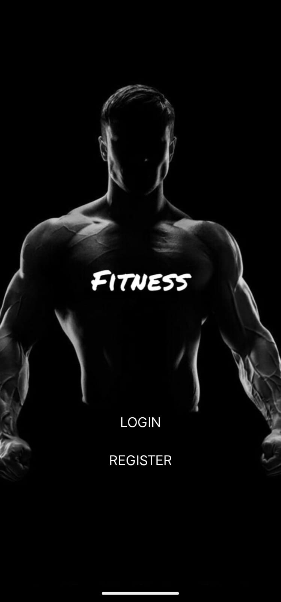
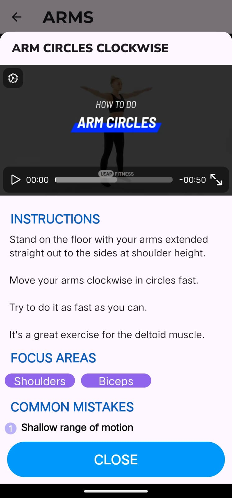

# Fitness

A Home Fitness App.

## Introduction

Users can login or register for free.  
Once logged in, user can choose which particular workout they wish to do.  
"How to do" is available for all the workouts included in the app.  
During the workout, users have the option to restart, pause or skip the current exercise.  
If an user happens to quit the workout, feedback is taken to improve the workouts.  
History Screen available to show the past workouts of the user.  
User Profile Screen to manage weight, height, workout preferences, etc.  

Data storage, user authentication implemented with Firebase.  
All depedencies/packages utilized mentioned in 'pubspec.yaml'

## Running

Download all the folders in a directory, and connect to an android emulator or to a smartphone
with usb debugging enabled.  
Once connected, run the command 'flutter run' in the terminal.

  
  
  
  

## PROJECT REPORT

The purpose of this project is to facilitate working out at home or in the absence of gym facilities.
Even with the increasing awareness of the importance of physical health, many individuals struggle to maintain consistency due to lack of motivation and guidance, and this project aims to tackle that issue.

The core functionality for this project is to allow the user to select any body part workout from the shown list and give instructions and timings/durations for the exercise in a particular sequence.

The app has workouts tailored for each body part, including meditation for the mind. 
Individual exercises (duration/reps) can be modified as per the user's convienence. Guidance is offered to all users for every exercise which includes instructions, a tutorial video, and some common mistakes. Users can view their BMI(body mass index), set workout reminders for any day within the next ten(10) days from that day. 

This project/app was made with the Flutter Software Development Kit, with Firebase for user authentication and Firestore for real-time database needs, storage for workout videos.

### The main challenges faced during the development of this app were:-

-> While loading the 'showModalBottomSheet' widget to display the 'How to do' for each exercise, the corresponding tutorial video is fetched from the Firestore storage, and the video was not being displayed automatically unless the user scrolled down causing the widget to reload, comprimising the user experience. Most online references/solutions were outdated as they were deprecated(removed). The solution implemented was by wrapping this widget with a 'stateBuilder' widget and creating a new 'stateSetter' function and implementing setState() with the new 'stateSetter' function, without requiring the user to manually trigger a reload by scrolling.

-> Implementing user notifications in a Flutter application posed significant challenges, largely due to the necessity of using a specific Flutter compiler version, alongside the complexities of configuring 'android/gradle' build settings and permissions. Issues were encountered when certain permissions were denied, or versions were found to be incompatible, resulting in unsuccessful notification deliveries. After conducting extensive research and consulting various resources, a detailed documentation was identified that provided the necessary guidance. This allowed for the correct configuration of required permissions, notification channels, and the scheduling of notifications with appropriate priority settings, ultimately ensuring reliable delivery to users.

### Future Scope:-

-> Animations for all exercices will be added.

-> Caching can be implemented once the number of the exercises become large  

-> Once enough training data is collected, personalized workouts can be specificily curated for the user's desired body goal  

-> Users will be able to share their workout statistics with other users in their 'friends list' through the app or via mail or any messaging platform  

-> Users will soon be able to connect with their smart wearables from the app via bluetooth, from which data like heart rate, steps, etc could be aquired

